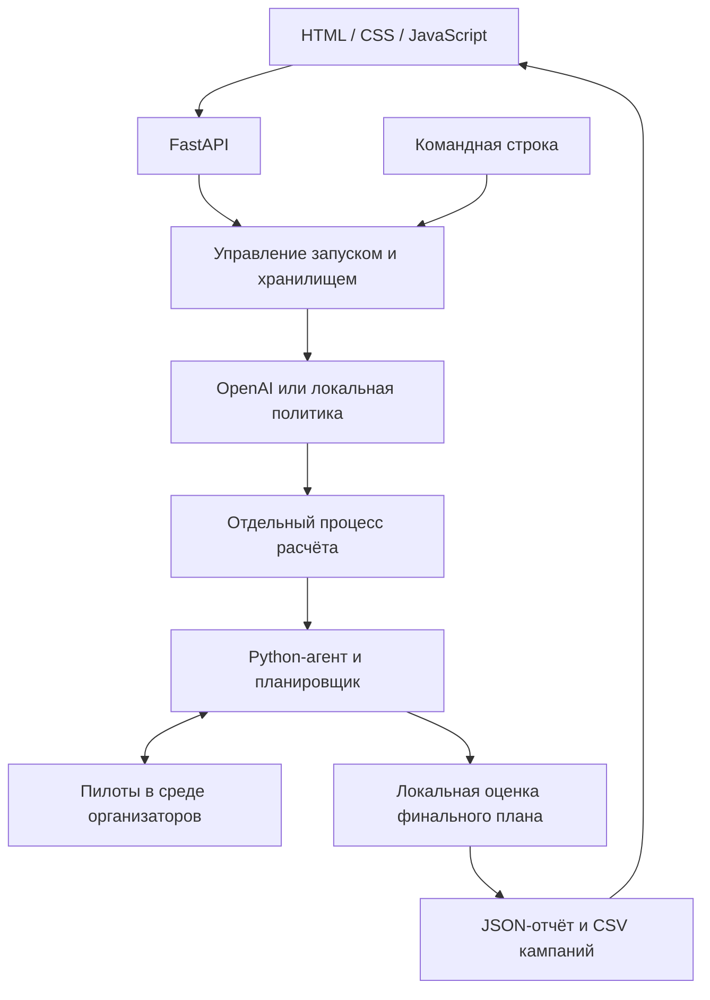

# BeeSmart — агент тарифных кампаний

Решение кейса **Beeline Tariff Marketing Campaigns**. Владелец задачи — **Билайн**.

## Краткое описание

Кампания по смене тарифа может снизить выручку: после перехода часть абонентов платит меньше, а ручной подбор сегментов не позволяет проверить все варианты. BeeSmart помогает маркетологу проверить гипотезы на небольших пилотах и сформировать план до **10 кампаний** с учётом бюджета и ограничений на контакты.

Исходный кейс рассчитан на синтетическую базу из **23 441 абонента**. Проект принимает три CSV, запускает агента и показывает кампании, затраты и результат локальной симуляции. ARPU — средняя выручка на абонента.

> Расчёт выполняется в mock-среде организаторов. Показанный эффект не является результатом реальной рассылки, гарантией дохода или баллом скрытого судейства.

## Что реализовано

- Загрузка и проверка трёх CSV через веб-интерфейс; запуск на заранее размещённом серверном наборе данных.
- Два режима агента: `openai` с выбором гипотез моделью и `local` с сохранённой базовой политикой без внешних API.
- Адаптивные пилоты: обновление оценок и пересборка плана после каждого наблюдения.
- Выбор сегментов, целевых тарифов и каналов связи в рамках общих ресурсов пилотов и финальных кампаний.
- Отображение состояния расчёта, журнала пилотов, кампаний, затрат и метрик локальной оценки.
- Скачивание финальных кампаний в `submission.csv` и полного отчёта в JSON.
- Расчёт из командной строки без запуска FastAPI и подготовка автономного пакета для судейства.
- HTTP API с сохранённым контрактом [open.json](open.json) для разработки фронтенда.
- Кэширование проверенных LLM-политик, локальный учёт расходов OpenAI и ограничение бюджета приложения.

Лимиты кейса, учитываемые при расчёте:

| Ресурс | Ограничение |
|---|---|
| Общий бюджет, включая пилоты | 100 000 у.е. |
| Общее число контактов, включая пилоты | 15 000 |
| Пилоты | До 20 |
| Финальные кампании | До 10 |
| Абоненты в одной кампании | До 5 000 |

## Как работает решение

1. Пользователь загружает профиль абонентов, историю переходов и справочник тарифов, задаёт seed и запускает агента.
2. Backend проверяет структуру и содержимое файлов, сохраняет набор в приватное хранилище.
3. В режиме `openai` языковая модель (LLM) выбирает приоритетные гипотезы по агрегатам данных. Ответ проверяется и сохраняется как политика запуска, задающая приоритеты проверок. При попадании в кэш повторный запрос не нужен. В режиме `local` используется базовая политика из репозитория.
4. Python-агент проводит пилоты в среде организаторов, обновляет статистические оценки и выбирает следующие проверки с учётом полученных результатов.
5. Планировщик формирует финальные кампании; официальный модуль локальной оценки (scorer) рассчитывает эффект и проверяет ограничения.
6. Пользователь изучает результат в интерфейсе и скачивает CSV с кампаниями или JSON-отчёт.

**Роль ИИ:** OpenAI действительно влияет на выбор гипотез для пилотов. Модель вызывается на этапе подготовки политики, до расчёта в worker. Обновление оценок, адаптация к результатам пилотов и контроль бюджета реализованы на Python. Итеративного обращения к LLM после каждого пилота нет; `Agent.act(env)` выполняется без сети.

Если подготовка OpenAI уже принятого запуска завершается обработанной ошибкой или таймаутом, расчёт продолжается с локальной политикой. Отчёт сохраняет причину, `llm.fallback_used` и расходы. Отсутствующий ключ или повреждённый журнал расходов выявляются до запуска и требуют исправления настройки. Подробности: [запасная логика](docs/agent.md#ошибки-и-запасная-логика).

## Технологии

| Компонент | Технологии и назначение |
|---|---|
| Backend | Python 3.12, FastAPI, Uvicorn, Pydantic — HTTP API, валидация и контракты |
| Расчёты | pandas, NumPy, собственные модули агента и планировщика |
| AI | OpenAI Responses API, модель `gpt-6-luna`; HTTP-клиент HTTPX |
| Frontend | HTML, CSS, JavaScript без Node.js и этапа сборки |
| Загрузка и настройки | python-multipart, python-dotenv |
| Проверка решения | Среда и scorer организаторов, pytest |
| Развёртывание | Подготовлены Dockerfile, Docker Compose и конфигурация Caddy для HTTPS |

Версии зависимостей закреплены в [requirements.txt](requirements.txt) и [requirements.lock](requirements.lock). NVIDIA/Brev в текущем расчёте не используется.

## Архитектура проекта



| Каталог / файл | Ответственность |
|---|---|
| `beesmart/agent/` | Расчётное ядро: гипотезы, интеграция OpenAI, статистика и планировщик |
| `beesmart/application/` | Общий для API и CLI процесс выполнения, worker, данные и хранилище |
| `beesmart/api/` | HTTP-маршруты FastAPI, проверка доступа и приём загрузок |
| `agent.py` | Адаптер `Agent.act(env)` для среды судейства |
| `organizer/` | Неизменённые модули среды, scorer и руководство организаторов |
| `policies/` | Базовая политика автономного агента |
| `static/` | Браузерный интерфейс |
| `open.json` | Публичная схема API без данных и ключей |
| `scripts/` | Настройка окружения, экспорт, проверка схемы и защита репозитория |
| `tests/` | Автоматические проверки |
| `docs/` | Подробные руководства по агенту, API, архитектуре и развёртыванию |

Расчётное ядро отделено от FastAPI: веб-сервер и CLI используют один процесс выполнения. Загруженные данные, отчёты и LLM-кэш хранятся на диске вне отслеживаемых Git файлов. По умолчанию это каталог `work/`.

Подробнее: [архитектура](docs/architecture.md) · [устройство агента](docs/agent.md) · [HTTP API](docs/api.md).

## Установка и запуск

### 1. Получить код и установить зависимости

Нужны **Git и Python 3.12**. Команды ниже предназначены для macOS/Linux и выполняются в терминале. Для уже клонированного проекта начните с перехода в его каталог.

```bash
git clone https://github.com/BAITC-Hacks/hack-9a0622c5-huita.git
cd hack-9a0622c5-huita
python3.12 -m venv .venv
source .venv/bin/activate
python -m pip install -r requirements.txt -c requirements.lock
python scripts/setup_env.py
python scripts/install_hooks.py
```

`setup_env.py` создаёт приватный `.env` с правами `0600` и токеном BeeSmart. Существующий `.env` сохраняется без изменений. Git-хуки проверяют коммиты и отправляемые файлы на приватные данные и секреты.

### 2. Выбрать режим агента

Для первого запуска **без ключей и платных API-запросов** откройте `.env` в редакторе и установите:

```dotenv
BEESMART_ENVIRONMENT=local
BEESMART_AGENT_PROVIDER=local
```

В шаблоне `.env.example` выбран `openai` с пустым ключом, поэтому переключение на `local` для автономной проверки нужно сделать явно.

Чтобы проверить интеграцию с OpenAI, задайте в приватном `.env`:

```dotenv
BEESMART_AGENT_PROVIDER=openai
BEESMART_OPENAI_MODEL=gpt-6-luna
BEESMART_LLM_BUDGET_USD=5
```

Заполните `OPENAI_API_KEY` своим ключом **только в локальном `.env`**. После изменения настроек перезапустите сервер. Нужен доступ аккаунта к выбранной модели; без ключа режим `openai` не запускает расчёт и не переключается автоматически на `local`. Лимит $5 относится к локальному учёту расходов приложения, а не к балансу аккаунта. [Настройки OpenAI](docs/agent.md).

### 3. Запустить веб-приложение

```bash
python -m beesmart
```

- Интерфейс: [http://127.0.0.1:8000](http://127.0.0.1:8000).
- Проверка сервера: [http://127.0.0.1:8000/api/health](http://127.0.0.1:8000/api/health).
- Контракт API: [open.json](open.json); при работающем сервере — [http://127.0.0.1:8000/open.json](http://127.0.0.1:8000/open.json).

CSV загружаются через интерфейс. Для набора, заранее размещённого на сервере, укажите в `.env` переменную `BEESMART_DATA_DIR` с путём к приватному пакету данных. Расположение его файлов приведено ниже. Путь к хранилищу результатов задаётся через `BEESMART_STORAGE_DIR`.

### Расчёт из терминала

Вместо веб-приложения можно использовать CLI. Замените `/path/package` на каталог своего пакета данных:

```bash
python -m beesmart.application --data-dir '/path/package' --provider local --seed 42
```

CLI выводит JSON-сводку и путь к сохранённому отчёту. Перед запуском остановите веб-сервер, если он использует то же хранилище: одновременно каталогом владеет один процесс.

Для развёртывания на сервере предусмотрены Docker/Compose и HTTPS через Caddy. Порядок настройки домена, токена, постоянного тома и одной реплики описан в [руководстве по развёртыванию](docs/deployment.md).

## Как проверить решение

### Сценарий для жюри

1. Выполните установку, выберите `BEESMART_AGENT_PROVIDER=local` и запустите приложение.
2. Откройте интерфейс и вкладку **«Загрузить CSV»**. Выберите из пакета организаторов:

   - **«Абоненты»** — `customer_profile.csv`;
   - **«Переходы»** — `data/change_tariff.csv`;
   - **«Тарифы»** — `data/dict_tariff.csv`.

3. Оставьте **Seed = 42** и нажмите **«Запустить агента»**. Seed фиксирует случайность симуляции для повторения расчёта с теми же данными и политикой.
4. Дождитесь завершения. Проверьте журнал пилотов, выбранные сегменты, тарифы, каналы и метрики. В JSON-отчёте успешный технический запуск имеет `status="completed"`; `metrics.status` отражает отдельную проверку плана scorer'ом.
5. Нажмите **«Скачать CSV»** и **«Отчёт JSON»**. CSV содержит финальные кампании, JSON — также события пилотов, диагностику и метрики. Сопоставьте число кампаний, затраты и контакты с лимитами кейса.
6. Для проверки этапа LLM настройте режим `openai` по инструкции выше и повторите запуск. В поле `llm` JSON-отчёта доступны провайдер, модель, статус и `cache_hit`: попадание в кэш означает, что новый платный запрос не выполнялся.

Положительный прирост выручки не гарантируется. Отрицательный эффект симуляции сам по себе не означает технический сбой приложения.

### Автоматические проверки

Из корня проекта, в активированном виртуальном окружении:

```bash
python -m pip install -r requirements-dev.txt -c requirements.lock
python -m pytest tests -q
python scripts/export_openapi.py --check
python scripts/check_repository.py --all
```

Основные тесты используют сгенерированные данные и подменённые ответы API, без платных запросов. Они проверяют в том числе влияние выбранных гипотез и результатов пилотов на решения агента, загрузку CSV и независимость расчёта от FastAPI. Проверка на исходных CSV может быть пропущена при их отсутствии; JavaScript-проверки зависят от наличия системного JavaScriptCore.

### Пакет для судейства

После завершённого запуска с seed 42 замените `RUN_ID` на его UUID из JSON-отчёта:

```bash
python scripts/build_submission.py --run RUN_ID
```

Экспортёр фиксирует политику запуска, воспроизводит план официальным генератором и сверяет CSV с отчётом. Результат сохраняется приватно, по умолчанию в `work/submissions/`. Если CLI использовал пути, отличающиеся от `.env`, передайте экспортёру те же `--data-dir` и `--storage-dir`. [Состав и условия экспорта](docs/agent.md#экспорт-для-хакатона).

## Данные и интеграции

Нужен локальный пакет организаторов со следующей структурой:

```text
package/
├── customer_profile.csv
└── data/
    ├── change_tariff.csv
    └── dict_tariff.csv
```

| Файл | Назначение и обязательные колонки | Лимит загрузки |
|---|---|---|
| `customer_profile.csv` | Профиль: `ID_NUMBER`, `current_tariff`, `arpu_segment`, `data_segment`, `call_segment`, `predicted_arpu` | 32 МиБ, 100 000 строк |
| `change_tariff.csv` | История: `ID_NUMBER`, `tariff_plan_code_from`, `tariff_plan_code_to`, `AVG_ARPU_PREV_3M`, `AVG_ARPU_NEXT_3M` | 16 МиБ, 200 000 строк |
| `dict_tariff.csv` | Справочник: `tariff_plan_code`, `price_tariff` | 256 КиБ, 100 тарифов |

Формат — UTF-8, разделитель запятая, десятичная точка. Общий размер запроса — до 50 МиБ. Профиль должен уже содержать `predicted_arpu`; преобразование сырых таблиц трафика и месячного ARPU в профиль не реализовано. Полные требования — в [описании API](docs/api.md).

**Источники:** синтетические данные и локальная среда организаторов Билайн. Исходные CSV отсутствуют в Git: для ручной демонстрации их нужно получить из выданного пакета. [Руководство организаторов](organizer/PARTICIPANT_GUIDE.md).

**Внешний сервис:** в режиме `openai` сервер обращается к OpenAI Responses API. Модели передаются агрегаты и обезличенные идентификаторы гипотез и тарифов, без исходных строк и ID абонентов. В `local` внешняя AI-интеграция не используется.

**Хранение:** `.env`, CSV, загрузки, отчёты и приватные LLM-политики исключены из Git. Ключ OpenAI не передаётся браузеру и процессу расчёта. В репозитории хранится только безопасный шаблон `.env.example`. [Правила работы с данными и секретами](docs/secrets.md).

## Ограничения

- Оценка выполняется в локальной mock-среде; подключения к реальным рассылкам и системам запуска кампаний Билайн нет.
- Пилоты шумные, планировщик использует эвристики. Глобальный оптимум и положительный эффект не гарантируются.
- LLM выбирает начальные гипотезы. Последующие решения принимает Python-агент; многократный цикл LLM tool calling не реализован.
- Одновременно поддерживается один расчёт, одна реплика backend и один worker Uvicorn. Очередь не распределённая.
- Production-доступ рассчитан на доверенную команду с общим Bearer-токеном; отдельных аккаунтов и разграничения данных между пользователями нет.
- Нужны готовые CSV требуемой схемы. Возможности загрузки ограничены размером файлов и допустимостью сегментов для пилотов и кампаний.
- Docker-сборка, Compose и внешний HTTPS требуют проверки на целевом сервере; наличие конфигурации не подтверждает готовое развёртывание.
- Локальный запуск рассчитан на macOS/Linux; хранилище использует POSIX-блокировку `fcntl`.

## Развёрнутая версия

Публичный адрес развёрнутой версии **в репозитории не указан**. После локального запуска приложение доступно по адресу [http://127.0.0.1:8000](http://127.0.0.1:8000).
