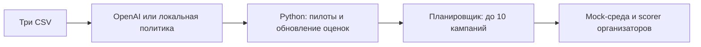

# BeeSmart — агент тарифных кампаний

Решение кейса **Beeline Tariff Marketing Campaigns**: проверить гипотезы о смене тарифа и собрать до 10 кампаний в пределах бюджета. Backend — Python/FastAPI, интерфейс — HTML/CSS/JavaScript без Node.js.

В режиме `openai` GPT-6 Luna один раз выбирает приоритетные гипотезы по агрегатам. Затем Python-агент адаптивно проводит пилоты, обновляет оценки и строит план. При попадании в кэш новый запрос модели не нужен. Режим `local` использует сохранённую базовую политику без сетевых вызовов.



Лимиты: **100 000 у.е.**, **15 000 контактов**, **20 пилотов**, **10 финальных кампаний**. Пилоты и финальный план расходуют общие ресурсы. Выдача организаторов синтетическая; локальный результат не является баллом скрытого судейства или гарантией дохода.

## Быстрый запуск

Нужен Python 3.12. Из корня репозитория:

```bash
python3.12 -m venv .venv
source .venv/bin/activate
python -m pip install -r requirements.txt -c requirements.lock
python scripts/setup_env.py
python scripts/install_hooks.py
nano .env
```

Для первого теста без платных запросов поставьте в `.env` `BEESMART_AGENT_PROVIDER=local`. Для OpenAI выберите `openai` и заполните `OPENAI_API_KEY` только в приватном `.env`. Новый `.env.example` выбирает OpenAI с пустым ключом; без настройки запуск этого режима заблокирован. Существующий `.env` скрипт не меняет. [Настройки агента](docs/agent.md).

Запустите API и интерфейс:

```bash
python -m beesmart
```

Откройте **http://127.0.0.1:8000**. Загрузите три файла из локального пакета организаторов:

- `customer_profile.csv` — профиль с готовым `predicted_arpu`;
- `data/change_tariff.csv` — история переходов;
- `data/dict_tariff.csv` — тарифы.

После запуска интерфейс показывает пилоты, кампании, метрики и скачивание CSV/JSON. Данные не входят в Git. Для предустановленного набора укажите папку пакета в `BEESMART_DATA_DIR`; приватное хранилище задаётся через `BEESMART_STORAGE_DIR` (по умолчанию `work/`). [Формат файлов и HTTP API](docs/api.md).

## Расчёт без веб-сервера

CLI использует тот же процесс расчёта, настройки `.env` и хранилище:

```bash
python -m beesmart.application --data-dir '/path/package' --provider local --seed 42
```

Для подготовки политики моделью замените `local` на `openai`; нужен серверный ключ и доступный лимит приложения. CLI выводит JSON-сводку с путями к приватным отчётам. Сначала остановите веб-сервер, использующий то же хранилище: одновременно им владеет только один процесс.

## Экспорт для хакатона

После завершённого запуска с seed 42:

```bash
python scripts/build_submission.py --run <UUID>
```

Экспортёр фиксирует точную политику, воспроизводит план официальным генератором и сверяет CSV с отчётом. Если CLI использовал пути, отличающиеся от `.env`, передайте экспортёру те же `--data-dir` и `--storage-dir`. Результат сохраняется приватно, по умолчанию в `work/submissions/`. [Условия и состав экспорта](docs/agent.md#экспорт-для-хакатона).

## Где что находится

| Каталог / файл | Назначение |
|---|---|
| `beesmart/agent/` | Гипотезы, OpenAI, статистика пилотов и планировщик |
| `beesmart/application/` | Общий процесс расчёта, worker, данные и хранилище |
| `beesmart/api/` | HTTP-маршруты FastAPI, доступ и приём загрузок |
| `organizer/` | Неизменённая среда, scorer и руководство организаторов |
| `policies/` | Базовая политика для автономного агента |
| `agent.py` | Короткий адаптер `Agent.act(env)` для судейства |
| `static/` | Веб-интерфейс без сборки и внешних зависимостей |
| `open.json` | Публичный контракт API без данных и ключей |

[Архитектура и поток расчёта](docs/architecture.md) · [Агент и OpenAI](docs/agent.md) · [API](docs/api.md) · [Развёртывание](docs/deployment.md) · [Данные и секреты](docs/secrets.md).

## Проверки и ограничения

```bash
python -m pip install -r requirements-dev.txt -c requirements.lock
python -m pytest tests -q
python scripts/export_openapi.py --check
python scripts/check_repository.py --all
```

Тесты создают вымышленные данные и не требуют CSV организаторов или платных запросов. JS-проверки используют системный JavaScriptCore, если он доступен. GitHub Actions настроен; выполнение зависит в том числе от доступного лимита и оплаты Actions у владельца репозитория.

OpenAI: лимит приложения по умолчанию **$5** из бюджета **$50**; расход учитывается локально, баланс аккаунта неизвестен. NVIDIA/Brev с отдельным бюджетом $50 пока не используется. 23 сентября 2026 года подтверждён один реальный вызов GPT-6 Luna на контрольных вымышленных данных: выбранные гипотезы прошли пилоты и дали допустимый план. Это проверка интеграции, а не обещание качества кампаний.

Production-конфигурация рассчитана на доверенную команду: HTTPS, общий Bearer-токен, разрешённые hosts/origins, постоянное хранилище, один worker и одна реплика. Docker/Compose и внешний TLS требуют проверки на целевом сервере. Пилоты шумные, а планировщик эвристический: положительный результат и глобальный оптимум не гарантируются.
