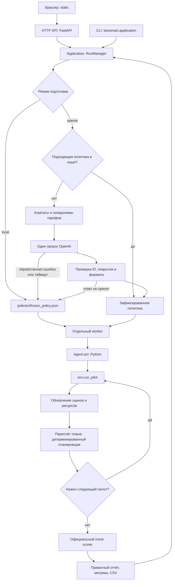

# Архитектура BeeSmart

BeeSmart разделён на HTTP API, общий процесс выполнения и расчётного агента. API и CLI запускают один `RunManager`; агент получает среду через контракт `Agent.act(env)`.

## Каталоги и ответственность

```text
agent.py                         адаптер контракта судейства
beesmart/
  __main__.py                    запуск веб-сервера
  config.py                      настройки и общие лимиты
  serialization.py               безопасное представление результата в JSON
  api/
    app.py                       маршруты FastAPI и жизненный цикл сервера
    access.py                    доступ, HTTPS, hosts/origins и авторизация
    body_limit.py                лимит тела HTTP-запроса
    upload_form.py               ограниченный разбор multipart
  application/
    __main__.py                  самостоятельный запуск из терминала
    runs.py                      общий процесс расчёта и состояние запусков
    worker.py                    изолированный процесс локальной оценки
    datasets.py                  описание предустановленного набора
    uploads.py                   проверка и сохранение загруженных CSV
    storage.py                   исключительное владение хранилищем
    contracts.py                 типизированные схемы результатов и API
  agent/
    domain.py                    данные, аудитории и очередь гипотез
    models.py                    каналы и статистические оценки
    runner.py                    адаптивный цикл пилотов
    planner.py                   построение и проверка финального плана
    llm.py                       агрегаты и запрос OpenAI Responses API
    intelligence.py              подготовка политики, кэш и учёт расходов
organizer/
  environment.py                 публичный контракт среды
  mock_environment.py            локальные синтетические эффекты
  scoring_core.py                 локальный подсчёт результата
  local_eval.py                   официальный локальный оценщик
  make_submission.py              официальный генератор submission.csv
  PARTICIPANT_GUIDE.md            руководство организаторов
policies/frozen_policy.json       базовая локальная политика
static/                          HTML, CSS и JavaScript
scripts/                         экспорт, проверки и служебные команды
open.json                        публичная схема API
```

Файлы в `organizer/` сохраняются без изменений. Их исходные относительные импорты настраивает изолированный worker или экспортёр. Пользователь запускает команды BeeSmart из корня проекта.

## Путь одного расчёта



1. **Вход.** API проверяет HTTP-запрос, доступ и загрузку; application проверяет данные и создаёт запись запуска. CLI передаёт каталог данных в тот же процесс выполнения.
2. **Политика.** В режиме OpenAI модель выбирает приоритетные гипотезы из подготовленного списка по агрегатам. Один некэшированный этап делает не более одного запроса, без автоматических повторов. Проверенная политика фиксируется до пилотов. В локальном режиме читается базовая политика.
3. **Адаптивная проверка.** Python выбирает очередную гипотезу и размер пилота, вызывает `env.run_pilot`, обновляет статистику, пересчитывает план и решает, оправдана ли ещё одна проверка. История переходов помогает с приоритетом; оценки будущих кампаний опираются на пилоты.
4. **План.** После каждого пилота планировщик заново выбирает непересекающиеся аудитории, целевые тарифы и каналы по консервативной оценке эффекта. При заданных наблюдениях и ресурсах правила выбора детерминированы. Учитываются общие расходы на пилоты и финальные контакты, лимит кампаний и охвата.
5. **Оценка.** Worker передаёт план официальной локальной среде. Scorer возвращает метрики; application сохраняет итоговый отчёт. UI показывает полученные события и метрики.

Это гибридный агент: OpenAI влияет на порядок исследования, а Python принимает последующие решения по наблюдениям. Итеративный LLM tool calling в этой реализации не используется. Результаты пилотов не отправляются модели для очередного решения. По [руководству кейса](../organizer/PARTICIPANT_GUIDE.md) LLM опционален; цикл выбора пилотов и обновления плана работает и в локальном режиме.

События `agent_planning` и `agent_policy_ready` отражают подготовку политики или явно отмеченное попадание в кэш. При обработанной ошибке принятого запуска появляется `agent_fallback`: используется локальная политика, а `llm.status` остаётся `failed`, причина и расходы сохраняются. Предзапусковые ошибки настройки и учёта блокируют запуск; отмена процесса не включает резервную стратегию. Подготовка получает не более 50 секунд и 20% общего срока; worker — остаток стандартных 540 секунд. [Полный контракт резервной логики](agent.md#ошибки-и-запасная-логика). Подставной HTTP-транспорт используется только в тестах.

## Границы компонентов

| Компонент | Что делает | Зависимость от HTTP |
|---|---|---|
| `api/` | Принимает запросы, проверяет доступ, отдаёт схемы и файлы | FastAPI |
| `application/` | Управляет запуском, worker и приватным хранилищем | API и CLI используют его одинаково |
| `agent/runner.py`, `domain.py`, `models.py`, `planner.py` | Работают через публичную среду и формируют кампании | Не импортируют FastAPI; во время `act` сети нет |
| `agent/llm.py`, `intelligence.py` | Готовят политику до расчёта и учитывают расходы | Внешний OpenAI REST только при выбранном режиме |
| `organizer/` | Предоставляет контракт и локальную оценку | HTTP не нужен |

Корневой `agent.py` только наследует `CampaignAgent`. Его импорт не запускает веб-сервер и не загружает FastAPI или модуль OpenAI. Для офлайн-сдачи экспортёр переносит выбранную политику вместе с необходимыми исходниками. Подготовленную OpenAI политику можно воспроизвести без ключа и сети.

## Данные и состояние

`BEESMART_DATA_DIR` указывает на приватный исходный набор с тремя CSV. `BEESMART_STORAGE_DIR` хранит:

| Подкаталог | Содержимое |
|---|---|
| `datasets/` | Последние 5 загруженных наборов |
| `runs/` | Последние 20 отчётов |
| `llm/policies/` | До 128 проверенных политик |
| `llm/spend.json` | Оценка расходов и незакрытые резервы OpenAI |
| `submissions/` | Приватные воспроизводимые экспорты |

Одно хранилище одновременно принадлежит одному процессу API или CLI. Внутри процесса допускается один активный расчёт. Поэтому самостоятельный запуск с тем же хранилищем требует остановить сервер, даже если сервер сейчас ничего не считает. После прерывания незавершённый отчёт восстанавливается как `failed`.

Для локального теста CLI можно явно указать отдельный `--storage-dir`. У каждого такого каталога собственный журнал расходов. При OpenAI используйте общее постоянное хранилище и останавливайте сервер перед CLI, чтобы сохранить единый лимит приложения.

## Что означает результат

`metrics` поступают от mock scorer организаторов; `diagnostics` содержат внутренние оценки агента. Обоснование OpenAI — текст о выборе гипотез, а не измеренный эффект. Пилоты шумные, планировщик эвристический, поэтому положительный прирост и глобальный оптимум не гарантируются.

`run.status="completed"` означает завершение расчёта и не равен экономическому
`metrics.status="PASS"`: отрицательный результат остаётся корректно выполненным
расчётом с `metrics.status="FAIL"`. Успешный локальный расчёт после сбоя OpenAI
сохраняет `llm.status="failed"` и `fallback_used=true`.

Для воспроизведения нужны одинаковые код, данные, политика и seed. `scripts/build_submission.py` проверяет фактическое совпадение CSV с выбранным отчётом. Совпадение локального плана не подтверждает будущий результат скрытого судейства.

Подробнее: [агент и OpenAI](agent.md), [контракт API](api.md), [развёртывание](deployment.md), [секреты и Git](secrets.md).
